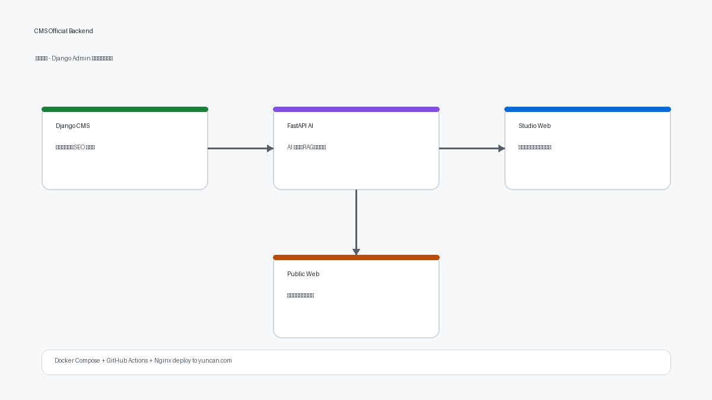
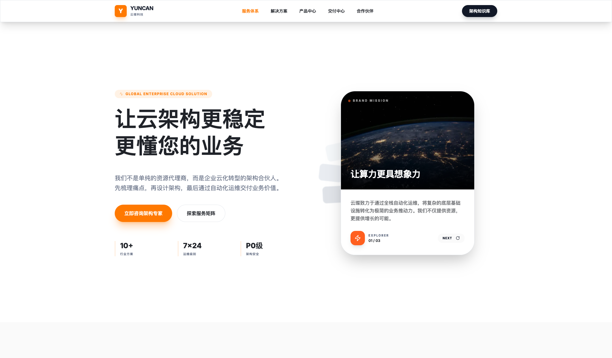
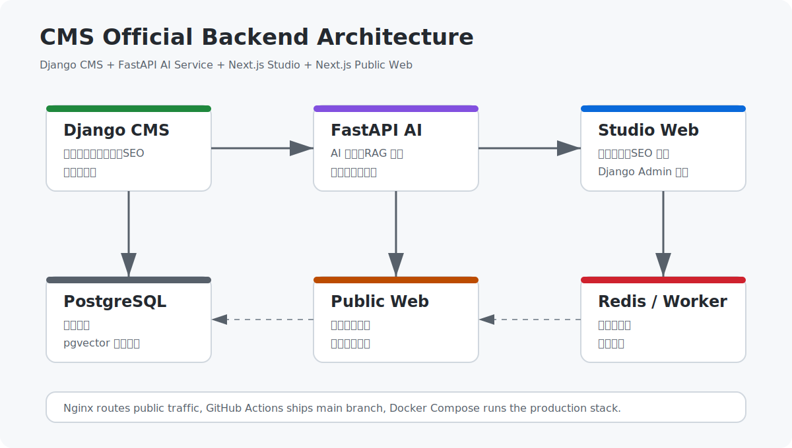

# 🚀 CMS 官网后台

> 面向企业官网内容生产、SEO 发布、运营协作与监控分析的一体化内容平台。

[](https://github.com/zhaoyongze123/cms-official-backend/actions/workflows/deploy-main.yml)
[](https://www.python.org/)
[](https://www.djangoproject.com/)
[](https://fastapi.tiangolo.com/)
[](https://nextjs.org/)
[](https://www.docker.com/)
[](LICENSE)

线上生产站点： [yuncan.com](https://yuncan.com)

<p align="center">
  
</p>

## 🖼️ Preview

<p align="center">
  
</p>

## ✨ 项目简介

这是一个围绕企业官网内容运营构建的 monorepo，当前包含四个核心应用：

- `Django CMS`：内容、后台、发布、SEO 真相源
- `FastAPI AI Service`：AI / RAG / 工作流能力
- `Next.js Studio`：内部编辑与监控工作台
- `Next.js Public Web`：对外官网展示站点

适合以下场景：

- 企业官网后台重构与统一部署
- 内容编辑、SEO 配置、监控分析一体化
- Django 后台与现代前端工作台并行协作
- 面向团队协作的内容平台演进

## 🧭 快速导航

- [项目概览](#项目概览)
- [技术栈](#技术栈)
- [仓库结构](#仓库结构)
- [本地开发](#本地开发)
- [测试与质量校验](#测试与质量校验)
- [GitHub Actions 自动部署](#github-actions-自动部署)
- [API 与路由概览](#api-与路由概览)
- [Roadmap](ROADMAP.md)
- [Contributing](CONTRIBUTING.md)
- [Security](SECURITY.md)
- [License](LICENSE)
- [安全说明](#安全说明)
- [English Summary](#english-summary)

## 📦 项目概览

- `apps/cms-api`：Django 主应用，负责内容、后台、发布、SEO 渲染、媒体与对内对外 API。
- `apps/ai-service`：FastAPI AI/RAG 服务，负责 AI 调用、检索与工作流编排。
- `apps/studio-web`：Next.js 内部编辑工作台，承接文章编辑、SEO 监控、后台嵌入页面。
- `apps/public-web`：Next.js 对外站点，承接官网公开展示页。
- `packages/editor-protocol`：前后端共享的编辑协议包。

当前仓库同时维护开发环境与生产环境两套 Compose 配置，并提供 `main` 分支自动部署工作流。

## 🛠️ 技术栈

- 后端：Python 3.12、Django、Gunicorn
- AI 服务：FastAPI、Pytest
- 前端：Next.js 15、React 19、TypeScript
- 编辑器：TipTap
- 数据库：PostgreSQL 15 + pgvector
- 缓存：Redis 7
- 工程化：Docker Compose、GitHub Actions

## 🗂️ 仓库结构

```text
.
├── apps/
│   ├── ai-service/          FastAPI AI/RAG 服务
│   ├── aliyun_monitor/      阿里云监控相关能力
│   ├── cms-api/             Django 主应用
│   ├── media_library/       媒体库
│   ├── public-web/          Next.js 对外站点
│   ├── simple_cms/          Django CMS 业务模块
│   ├── studio-web/          Next.js 内部工作台
│   ├── sys_settings/        系统设置
│   └── users/               用户与权限
├── contracts/               OpenAPI / JSON Schema 契约
├── deploy/
│   └── nginx/               生产 Nginx 模板
├── docker/                  镜像入口与计划任务配置
├── packages/                共享包
├── scripts/                 部署与验证脚本
├── .github/workflows/       GitHub Actions 工作流
├── docker-compose.dev.yml   开发环境 Compose
├── docker-compose.prod.yml  生产环境 Compose
└── Dockerfile               后端基础镜像
```

## 🌟 核心能力

- 📝 Django Admin 后台与内容管理
- 🧩 文章创建、编辑、发布与 SEO 元数据维护
- 🖥️ Next.js 编辑器嵌入 Django Admin
- 🌐 对外公开站渲染与内容展示
- 🤖 AI 审核、生成与 RAG 检索服务骨架
- 📈 SEO 监控面板与站点健康数据接口
- 🚢 Docker 化开发、生产部署与自动化发布

## 🧱 系统架构

<p align="center">
  
</p>

```text
Browser / Operator
        │
        ├── Public Web (Next.js)
        │        │
        │        └── Django API
        │
        ├── Studio Web (Next.js)
        │        │
        │        ├── Django API
        │        └── Django Admin Embed Proxy
        │
        ├── Django CMS
        │        │
        │        ├── PostgreSQL + pgvector
        │        ├── Redis
        │        └── FastAPI AI Service
        │
        └── Nginx / GitHub Actions / Docker Compose
```

## 💻 本地开发

### 环境要求

- Docker / Docker Compose
- Node.js 22
- Python 3.12

### 环境变量

复制示例配置：

```bash
cp .env.example .env
```

`.env.example` 已包含开发环境所需的核心变量：

- Django：`SECRET_KEY`、`DEBUG`、`ALLOWED_HOSTS`
- PostgreSQL：`POSTGRES_DB`、`POSTGRES_USER`、`POSTGRES_PASSWORD`
- Redis：`REDIS_URL`
- 内部服务：`AI_SERVICE_URL`、`DJANGO_INTERNAL_BASE_URL`
- 前端：`NEXT_PUBLIC_DJANGO_BASE_URL`、`NEXT_PUBLIC_DJANGO_MEDIA_URL`、`NEXT_PUBLIC_EDITOR_BASE_URL`
- AI / RAG：`AI_PROVIDER`、`RAG_PROVIDER`
- 阿里云：`ALIYUN_*`

### 启动开发环境

```bash
COMPOSE_DOCKER_CLI_BUILD=0 DOCKER_BUILDKIT=0 docker compose -f docker-compose.dev.yml up -d --build
```

### 开发环境端口

- Django：`http://127.0.0.1:8001`
- Django Health：`http://127.0.0.1:8001/api/health/`
- FastAPI Health：`http://127.0.0.1:8002/health`
- Studio Web：`http://127.0.0.1:3000/django-admin/next-editor/login`
- Public Web：`http://127.0.0.1:3003/solutions`
- PostgreSQL：`127.0.0.1:15432`
- Redis：`127.0.0.1:16379`

### 开发环境最小验证

```bash
docker compose -f docker-compose.dev.yml ps
docker compose -f docker-compose.dev.yml exec -T web python manage.py check
curl -I http://127.0.0.1:8001/api/health/
curl -I http://127.0.0.1:8002/health
curl -I http://127.0.0.1:3000/django-admin/next-editor/login
curl -I http://127.0.0.1:3003/solutions
```

## ✅ 测试与质量校验

### Django

```bash
docker compose -f docker-compose.dev.yml exec -T web python manage.py check
docker compose -f docker-compose.dev.yml exec -T web python manage.py test
docker compose -f docker-compose.dev.yml exec -T web python manage.py makemigrations --check --dry-run
```

### FastAPI

```bash
curl -s http://127.0.0.1:8002/health
docker compose -f docker-compose.dev.yml exec -T ai-service pytest
```

### Studio Web

```bash
cd apps/studio-web
npm ci
npm run lint
npm run test
npm run build
```

### Public Web

```bash
cd apps/public-web
npm ci
npm run build
```

### 契约校验

```bash
python3 -m json.tool contracts/article.schema.json > /dev/null
python3 -m json.tool contracts/ai-review.schema.json > /dev/null
python3 -m json.tool contracts/ai-suggestion.schema.json > /dev/null
python3 -m json.tool contracts/ai-patch.schema.json > /dev/null
python3 -m json.tool contracts/rag-search.schema.json > /dev/null
python3 -m json.tool contracts/seo-context.schema.json > /dev/null
python3 -m json.tool contracts/tiptap-document.schema.json > /dev/null
```

## 🔁 GitHub Actions 自动部署

工作流文件位于 [`.github/workflows/deploy-main.yml`](.github/workflows/deploy-main.yml)。

触发方式：

- `push` 到 `main`
- 手动 `workflow_dispatch`

### CI 校验内容

`verify` 阶段会执行：

- Django `check`
- Django `test`
- FastAPI `pytest`
- Studio Web `lint`
- Studio Web `test`
- Studio Web `build`
- Public Web `build`
- `contracts/` JSON Schema 校验
- 后端 Docker 镜像构建

### 部署阶段行为

`build-and-push` 阶段会在通过验证后构建并推送生产镜像。

生产环境不再要求 GitHub Actions 直接 SSH 进服务器。推荐改为：

1. GitHub Actions 负责测试、构建、推送镜像
2. 生产服务器本机执行 `scripts/deploy_pull_prod.sh`
3. 由服务器主动 `docker compose pull && up`

这样发布链路不再依赖 GitHub Hosted Runner 的动态出口 IP。

### 需要配置的 GitHub Secrets

- `ACR_USERNAME`
- `ACR_PASSWORD`

如果服务器改走主动拉取部署，`PROD_SERVER_HOST`、`PROD_SERVER_USER`、`PROD_SSH_PRIVATE_KEY`、`PROD_DEPLOY_PATH`、`PROD_ENV_FILE` 不再是 GitHub Actions 主发布链路的必填项，而是只在你仍保留 SSH 辅助流程时才需要。

### 服务器主动拉取部署

服务器侧准备好 `.env.prod`、`docker-compose.prod.yml` 后，可直接执行：

```bash
cd /你的部署目录
bash scripts/deploy_pull_prod.sh
```

脚本默认会：

- 跳过 GitHub 仓库同步
- 直接使用服务器当前目录里的部署脚本和编排文件
- 从镜像仓库拉取最新镜像并重建容器

这样可以避免生产服务器发布时依赖 GitHub 网络连通性。

如果你明确需要服务器先同步仓库代码，再继续部署，可显式开启：

```bash
SKIP_GIT_SYNC=0 \
APP_BRANCH=main \
APP_REPO=https://github.com/zhaoyongze123/cms-official-backend.git \
bash scripts/deploy_pull_prod.sh
```

开启后脚本会先执行：

```bash
git fetch --prune origin
git checkout main
git reset --hard origin/main
```

这样服务器会先拿到最新部署脚本与编排文件，再拉最新镜像。

常见做法：

- 手动执行一次
- 用 `cron` 定时执行
- 用 `systemd timer` 定时执行
- 由你自己的内网 Runner / 运维机触发执行

## 🔌 API 与路由概览

### Django 关键入口

- `/api/health/`
- `/api/articles/`
- `/api/articles/{id}/`
- `/api/articles/{id}/analytics/`
- `/api/dashboard/seo-summary/`
- `/django-admin/`
- `/sitemap.xml`

### FastAPI 关键入口

- `/health`

## 🧠 运行机制说明

### Django 与 Studio Web 的关系

- Django Admin 提供后台与业务真相。
- Studio Web 通过 Django 暴露的 API 获取内容与监控数据。
- `/django-admin/next-editor/*` 通过 Django 代理到 Next.js。

## 🗺️ Roadmap

项目后续计划维护在 [`ROADMAP.md`](ROADMAP.md)，当前重点方向包括：

- 完善公开站页面截图与功能演示
- 补充 Django API 文档与示例请求
- 扩展 SEO 监控数据源接入说明
- 强化 AI 审核与 RAG 检索链路
- 增加端到端验收测试

## 🤝 Contributing

贡献流程、模块边界和推荐验证命令见 [`CONTRIBUTING.md`](CONTRIBUTING.md)。

提交前请特别注意：

- 不要提交真实 `.env`、`.env.prod`、Token、私钥或密码。
- 跨模块 API 变更需要同步更新 `contracts/`。
- PR 描述应包含变更内容、验证命令和影响范围。

## 🔐 安全说明

- 不要提交 `.env`、`.env.prod`、私钥、Token、真实密码。
- 不要在公开文档中写入生产网络拓扑、宿主机路径、容器内部地址、精确端口映射。
- GitHub Actions 不应打印 `PROD_ENV_FILE` 内容。
- 所有生产敏感信息请只保存在 GitHub Secrets 或服务器环境文件中。
- 安全报告与凭证处理建议见 [`SECURITY.md`](SECURITY.md)。

## English Summary

CMS Official Backend is a production-oriented content management platform for corporate websites. It combines Django CMS, FastAPI AI/RAG services, Next.js Studio, Next.js Public Web, PostgreSQL with pgvector, Redis, Docker Compose, Nginx, and GitHub Actions deployment.

The repository is designed for teams that need a maintainable CMS backend, an embedded editorial studio, SEO monitoring, AI-assisted content workflows, and a reproducible production deployment path.

## 📄 许可证

本项目使用 [MIT License](LICENSE)。
