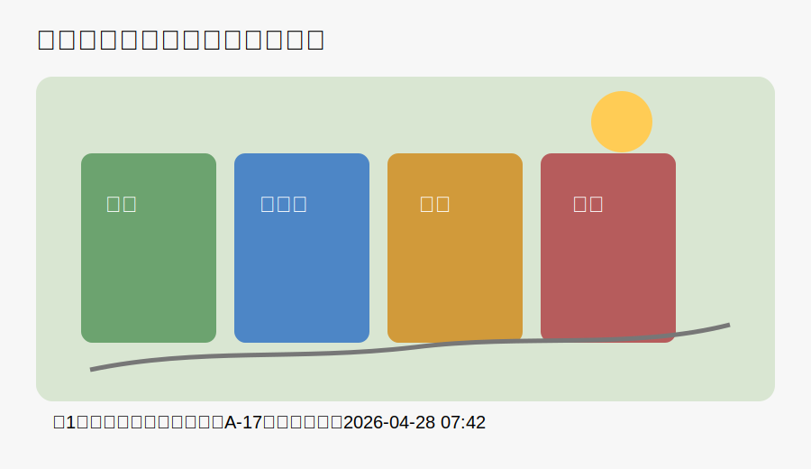
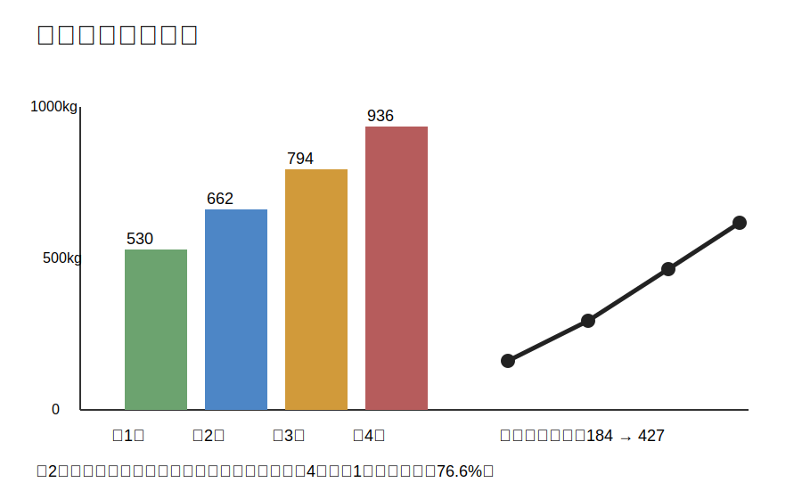
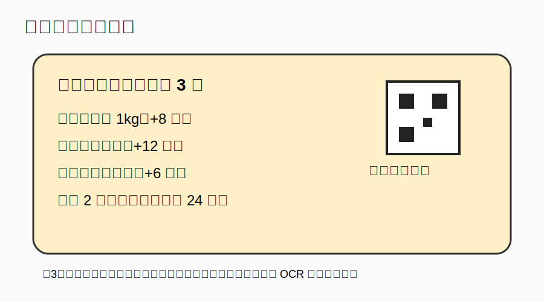
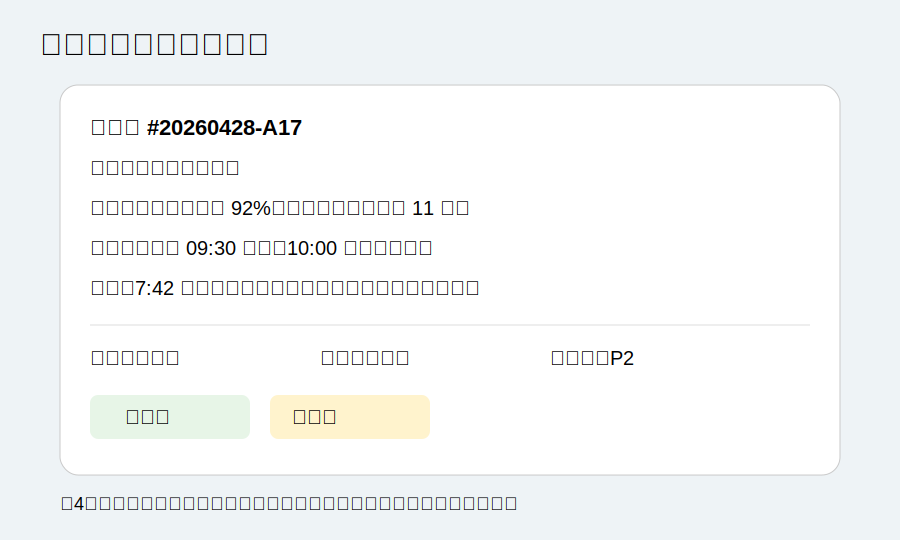

# 社区智能回收站试点四周观察：速度、准确率与居民参与度

**作者：林越｜发布日期：2026-05-11｜地点：杭州市滨江区**

过去一个月，滨江区东门社区在小区主入口、地下车库与快递驿站旁部署了 6 台智能回收站。项目目标不是简单增加垃圾桶数量，而是通过图像识别、称重传感器、扫码积分和异常派单，把居民投递行为转化为可追踪的数据。本文基于 2026 年 4 月 1 日至 4 月 28 日的试点记录，整理了回收量、误投率、参与人数和现场运营问题。

## 1. 回收量增长明显，但不同品类差异很大

试点第一周，6 个站点合计回收 530kg。到第四周，总回收量达到 936kg，较第一周增加 76.6%。增长主要来自纸箱和塑料瓶，原因是快递驿站旁的站点在周末使用频率最高。厨余垃圾增长较慢，部分居民仍习惯把厨余直接投入楼道传统垃圾桶。

从图表可以看出，扫码参与人数从 184 人增长到 427 人。运营人员认为，积分规则比宣传横幅更有效：居民只有在第一次获得积分后，才会形成稳定使用习惯。

## 2. OCR 与规则理解对系统体验影响很大

系统在每个站点张贴了积分规则海报。海报上包含多个数字条件，例如“厨余垃圾满 1kg +8 积分”“纸箱压扁 +12 积分”“误投 2 次以上暂停奖励 24 小时”。如果模型只能识别物体，但不能正确理解这些文字规则，就很难回答居民关于积分的具体问题。

实际测试中，居民最常问的三个问题是：

1. “塑料瓶没清空会不会扣分？”
2. “纸箱不压扁还能不能投？”
3. “为什么我今天没有积分？”

这类问题需要模型同时理解图片文字、用户上下文和规则约束，不能只做简单 OCR。

## 3. 运营侧最需要的是异常摘要，而不是单张图片识别

东门站点 A-17 在 4 月 28 日早上出现两类异常：纸类箱满载率达到 92%，有害箱传感器离线 11 分钟。更复杂的是，同一时间段还发生了一次误投：居民把玻璃瓶放进纸类箱，系统提示后才纠正。

对运营人员来说，模型如果能从巡检截图中提取“站点、时间、异常类型、责任人、优先级、下一步动作”，价值会明显高于只描述“这是一张工单截图”。

## 4. 结论：图文模型的测试重点

如果用这篇文章测试多模态模型，建议重点观察以下能力：

- 能否准确读出海报和工单里的中文、数字与时间。
- 能否根据图2计算第4周相较第1周的增长比例。
- 能否把图1的站点编号 A-17 与图4的巡检单联系起来。
- 能否区分“回收总量增长”和“误投/传感器异常”是两个不同问题。
- 能否根据文章内容回答综合问题，而不是只复述图片表面内容。

**推荐测试问题：**

1. 这次试点第4周回收量比第1周增加了多少？
2. 图3里哪些行为会增加积分，哪些行为会导致暂停奖励？
3. A-17 站点在 4 月 28 日出现了哪些异常？后续处理动作是什么？
4. 如果你是运营负责人，今天上午最应该先处理哪件事，为什么？
5. 这篇文章中，哪些信息来自图片，哪些信息来自正文？
